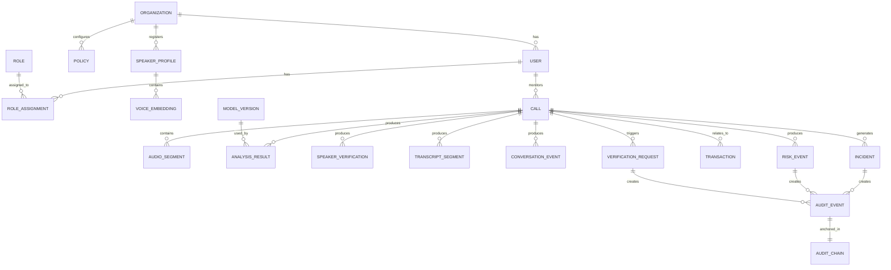
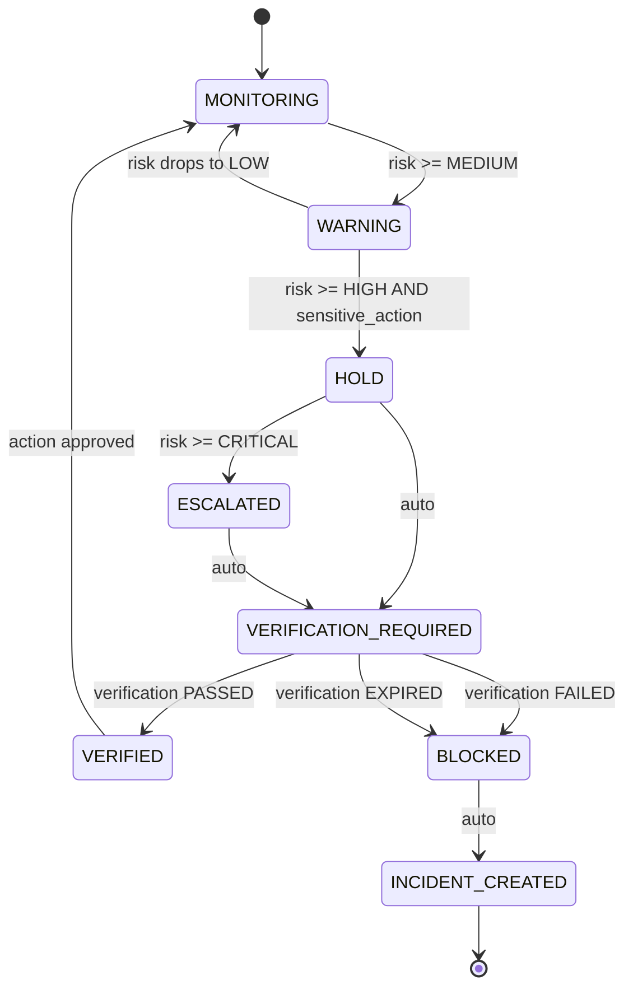
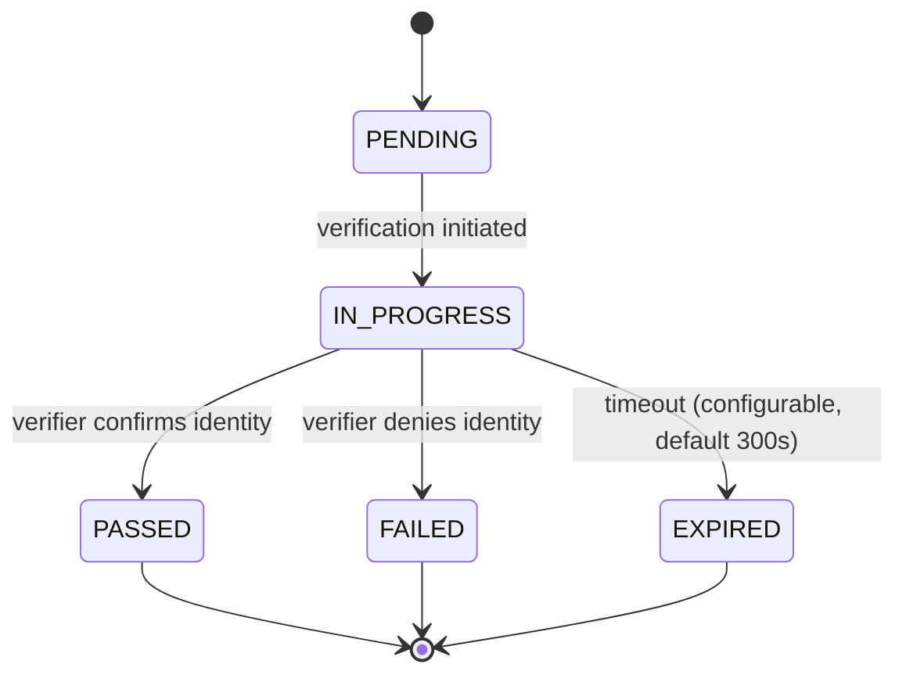
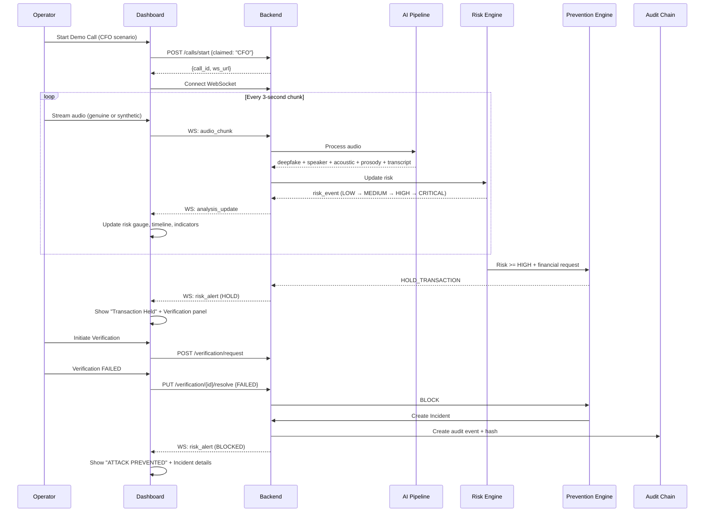
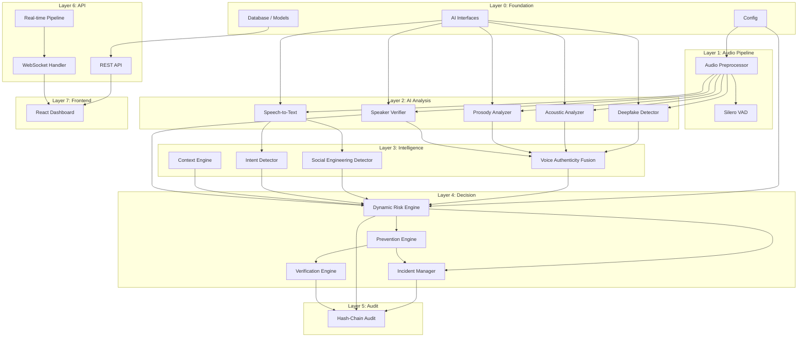

# VoiceGuard — Architecture Review Document

**Version**: 1.0  
**Date**: 2026-09-04  
**Status**: REVIEW — Awaiting approval before implementation  
**SIH Problem Statement**: SIH26104 — AI-Powered Real-Time Detection and Prevention of Voice Cloning Impersonation Attacks  
**Organization**: AICTE Cyber Security Cell  

---

## 1. Current Architecture Assessment

### 1.1 Existing State

The repository is **empty**. No prior code, configuration, or data exists.

### 1.2 Environment

| Resource | Status | Constraint |
|----------|--------|------------|
| Python 3.12.10 | ✅ Available | |
| Node.js 24.12 | ✅ Available | |
| npm 11.6.2 | ✅ Available | |
| Git 2.51.0 | ✅ Available | |
| PyTorch | ❌ Not installed | CPU-only install ~800MB–1.5GB disk |
| torchaudio | ❌ Not installed | Installed alongside PyTorch |
| FastAPI | ❌ Not installed | Lightweight pip install |
| Docker | ❌ Not available | Cannot use containerized services |
| NVIDIA GPU | ❌ Not available | All inference on CPU |
| PostgreSQL | ❌ Not available locally | Use SQLite for prototype |
| Redis | ❌ Not available | Use in-memory cache or asyncio queues |

### 1.3 Critical Hardware Constraint

**No GPU. No Docker. CPU-only development machine.**

This constraint drives every model selection, architecture, and latency decision. Any design that assumes GPU inference is rejected.

---

## 2. Problems Identified in the Prior Plan

| # | Problem | Severity | Resolution |
|---|---------|----------|------------|
| P1 | Plan proposes "ResNet-18 on Mel spectrograms" without verifying a pretrained checkpoint exists for deepfake detection | HIGH | Use a validated pretrained model from HuggingFace with published benchmark results |
| P2 | Plan lists "wav2vec2-base features" as a secondary feature source without specifying which model or how it integrates | MEDIUM | Defer wav2vec2 features. Use a single pretrained wav2vec2-based deepfake detector instead |
| P3 | Plan assumes SpeechBrain ECAPA-TDNN installs cleanly — SpeechBrain has heavy dependencies and may conflict with Python 3.12 | HIGH | Validate installation. Prepare fallback: resemblyzer or standalone ECAPA checkpoint |
| P4 | Plan uses raw `openai-whisper` for STT — this is 2–4x slower than `faster-whisper` on CPU | HIGH | Use `faster-whisper` (CTranslate2 backend) with INT8 quantization |
| P5 | Risk engine uses hardcoded weights presented without calibration documentation | MEDIUM | Document weights as DEFAULTS. Store in config. Mark as UNCALIBRATED |
| P6 | No model abstraction layer defined — models are coupled to business logic | HIGH | Define abstract interfaces for every AI module |
| P7 | No failure handling specification for AI module unavailability | HIGH | Define graceful degradation for every module |
| P8 | No demo mode architecture — live mode and demo mode share no contract | MEDIUM | Design unified event schema supporting both modes |
| P9 | Frontend and backend developed somewhat in parallel — user directive requires backend-first | MEDIUM | Reorder: complete backend pipeline before frontend |
| P10 | No threat model | HIGH | Create threat model before implementation |
| P11 | SQLite chosen without documenting migration path to PostgreSQL | LOW | Use SQLAlchemy ORM; document migration |
| P12 | Redis proposed but Docker unavailable — no alternative specified | MEDIUM | Use in-memory state with asyncio; Redis optional for deployment |
| P13 | Blockchain smart contract requires Hardhat + Node tooling — complexity for prototype | LOW | Hash-chain primary; smart contract secondary/optional |
| P14 | No signal confidence or availability tracking in risk engine | HIGH | Add signal metadata to risk calculation |
| P15 | No audio chunking configurability — hardcoded chunk sizes | MEDIUM | Make configurable; benchmark before selecting defaults |

---

## 3. Recommended Architecture Changes

### 3.1 Model Abstraction Layer (NEW)

Every AI module must implement a defined interface. Business logic never calls model internals directly.

```
┌─────────────────────────────────────────┐
│           Business Logic                │
│  (Risk Engine, Prevention, API)         │
├─────────────────────────────────────────┤
│         Module Interface                │
│  (DeepfakeDetector, SpeakerVerifier,    │
│   AcousticAnalyzer, ProsodyAnalyzer,    │
│   SpeechToText, ConversationAnalyzer)   │
├─────────────────────────────────────────┤
│         Model Adapter                   │
│  (Wav2Vec2Adapter, ECAPAAdapter,        │
│   WhisperAdapter, DemoAdapter,          │
│   UnavailableAdapter)                   │
├─────────────────────────────────────────┤
│         Actual Model                    │
│  (HuggingFace, ONNX, SpeechBrain,      │
│   faster-whisper, custom)               │
└─────────────────────────────────────────┘
```

Each adapter returns a **standardized result envelope**:

```json
{
  "module": "deepfake_detection",
  "model_name": "wav2vec2-deepfake-v1",
  "model_version": "1.0.0",
  "status": "SUCCESS",
  "result": {
    "synthetic_probability": 0.87,
    "classification": "SUSPICIOUS",
    "confidence": 0.84
  },
  "processing_time_ms": 412,
  "timestamp": "2026-09-04T17:00:00Z",
  "mode": "LIVE"
}
```

Status values: `SUCCESS`, `DEGRADED`, `UNAVAILABLE`, `ERROR`

Mode values: `LIVE`, `DEMO`, `BENCHMARK`

### 3.2 Graceful Degradation (NEW)

| Module | Failure Behavior |
|--------|-----------------|
| Deepfake Detector | Return `status: UNAVAILABLE`. Risk engine lowers confidence. Dashboard shows "Analysis unavailable". |
| Speaker Verifier | Return `status: UNAVAILABLE`. Risk engine adjusts available-evidence factor. |
| STT | Continue voice analysis. No transcript. Social engineering score marked unavailable. |
| Acoustic Analyzer | Return `status: UNAVAILABLE`. Fusion excludes signal. |
| Prosody Analyzer | Return `status: UNAVAILABLE`. Fusion excludes signal. |
| WebSocket | Reconnect with exponential backoff. Recover session state. |
| Database | Fail safely. Log error. Continue in-memory where possible. |

### 3.3 Demo Mode Architecture (NEW)

```
┌──────────────────────┐
│   Event Schema       │ ← Same schema for LIVE and DEMO
├──────────────────────┤
│                      │
│  LIVE MODE:          │  DEMO MODE:
│  Real audio →        │  Recorded events →
│  Real inference →    │  Timed replay →
│  Real results        │  Labeled "DEMO"
│                      │
└──────────────────────┘
```

The frontend displays **identical UI** for both modes. Demo mode adds a visible `DEMO SIMULATION` banner.

### 3.4 Signal Confidence in Risk Engine (NEW)

Each signal fed to the risk engine carries metadata:

```json
{
  "signal_name": "voice_authenticity",
  "value": 0.87,
  "confidence": 0.84,
  "available": true,
  "fresh": true,
  "timestamp": "...",
  "source_module": "deepfake_detection",
  "model_version": "wav2vec2-deepfake-v1"
}
```

The risk engine adjusts calculation based on:
- **Availability**: Unavailable signals are excluded; confidence decreases.
- **Confidence**: Low-confidence signals are weighted less.
- **Freshness**: Stale signals (>30s old) are deprioritized.

---

## 4. Technology Decisions

> All decisions are documented as Architecture Decision Records in `docs/decisions/`.

### Summary Matrix

| Component | Decision | Alternative Considered | Rationale |
|-----------|----------|----------------------|-----------|
| **Backend** | Python FastAPI | Flask, Django, Node.js | Native AI ecosystem, async support, Pydantic validation, WebSocket support |
| **Database** | SQLite + SQLAlchemy ORM | PostgreSQL, MongoDB | Zero-config for prototype; SQLAlchemy makes PostgreSQL migration a config change |
| **Frontend** | React + Vite + TypeScript | Next.js, Vue, Svelte | Mature ecosystem, excellent charting libraries, strong typing |
| **Deepfake Detection** | `wav2vec2-deepfake-detector` (HuggingFace pretrained) | Custom ResNet-18, AASIST, Res2TCNGuard | Pretrained, validated, CPU-compatible, HuggingFace transformers API |
| **Speaker Verification** | SpeechBrain ECAPA-TDNN (pretrained VoxCeleb) | resemblyzer, pyannote | State-of-the-art, 192-dim embeddings, CPU-feasible (~14M params) |
| **Speech-to-Text** | `faster-whisper` base (INT8) | openai-whisper, whisper.cpp | 2–4x faster than vanilla Whisper on CPU, INT8 quantization, Python native |
| **VAD** | Silero VAD | WebRTC VAD, energy-based | <1ms per 30ms chunk, 1–2MB model, enterprise-grade accuracy |
| **Acoustic Analysis** | librosa + numpy | torchaudio features | No PyTorch dependency for feature extraction, well-documented |
| **Real-time Streaming** | WebSocket (FastAPI) | WebRTC, gRPC | Simpler prototype; sufficient for SIH demo |
| **Blockchain/Audit** | SHA-256 hash-chain (primary), Hardhat (optional) | Hyperledger, full Ethereum | Hash-chain gives tamper-evidence without infra; smart contract optional |
| **Cache** | In-memory dict + asyncio Queue | Redis | Docker unavailable; memory-based acceptable for prototype |

---

## 5. AI Model Selection Matrix

| Model | Task | Params | Disk | RAM (est.) | CPU Latency (3s audio) | Input | Output | License |
|-------|------|--------|------|------------|----------------------|-------|--------|---------|
| `wav2vec2-deepfake-detector` | Deepfake detection | ~95M | ~380MB | ~500MB | **300–800ms** (ESTIMATE) | 16kHz mono waveform | [real_prob, fake_prob] | Apache 2.0 |
| ECAPA-TDNN (SpeechBrain) | Speaker embedding | ~14M | ~60MB | ~200MB | **100–300ms** (ESTIMATE) | 16kHz mono waveform | 192-dim embedding | Apache 2.0 |
| `faster-whisper` base INT8 | Speech-to-text | ~74M | ~80MB | ~200MB | **RTF ~0.5–1.0** (ESTIMATE) | 16kHz mono | text + timestamps + language | MIT |
| Silero VAD | Voice activity | <1M | ~2MB | ~10MB | **<1ms per 30ms chunk** (MEASURED in literature) | 16kHz/8kHz | speech probability | MIT |
| librosa (feature extraction) | Acoustic analysis | N/A | ~5MB | ~50MB | **10–50ms** (ESTIMATE) | any sample rate | spectral features | ISC |

> [!WARNING]
> **All latency values marked ESTIMATE must be benchmarked on the actual development machine before being reported as facts.** The benchmarking step is mandatory before integration tests.

### Model Feasibility Risks

| Model | Risk | Mitigation |
|-------|------|------------|
| wav2vec2 deepfake detector | May be too slow on CPU (~800ms per chunk) | Benchmark first. Fallback: ONNX export. Alternative: lighter model (Res2TCNGuard) |
| SpeechBrain ECAPA-TDNN | Heavy dependency tree; may not install cleanly on Python 3.12/Windows | Test installation first. Fallback: resemblyzer (~5MB, less accurate) or standalone embedding model |
| faster-whisper | CTranslate2 requires Python ≤3.12 (compatible). May not support Python 3.13+ | Currently compatible. Pin Python version |
| Silero VAD | Requires PyTorch (or ONNX Runtime) | Install PyTorch CPU-only; ONNX fallback available |

---

## 6. Database Entity-Relationship Design



### Core Entities

| Entity | Key Fields | Privacy Notes |
|--------|-----------|---------------|
| `users` | id, email, password_hash, org_id, role | Password hashed with bcrypt |
| `organizations` | id, name, domain, settings | |
| `roles` | id, name, permissions[] | ADMIN, SECURITY_OFFICER, EMPLOYEE, SUPERVISOR |
| `speaker_profiles` | id, name, org_id, claimed_role, created_at | No raw audio stored |
| `voice_embeddings` | id, profile_id, embedding_vector, model_version, created_at | Embedding only, not raw audio |
| `calls` | id, org_id, caller_id, claimed_identity, start_time, end_time, status, mode | |
| `audio_segments` | id, call_id, sequence, duration_ms, sample_rate, quality_score | Raw audio NOT persisted by default |
| `analysis_results` | id, call_id, segment_seq, module, model_version, result_json, confidence, processing_ms | |
| `speaker_verifications` | id, call_id, profile_id, similarity_score, status, model_version | |
| `transcript_segments` | id, call_id, start_ms, end_ms, text, language, confidence | |
| `conversation_events` | id, call_id, event_type, indicator, evidence_text, confidence, timestamp | |
| `risk_events` | id, call_id, timestamp, risk_score, risk_level, confidence, reasons[], signals_json, trigger | |
| `transactions` | id, call_id, type, amount, currency, status, requested_by, approved_by | Simulated for prototype |
| `verification_requests` | id, call_id, incident_id, method, status, requested_at, resolved_at, result | |
| `incidents` | id, call_id, timestamp, risk_score, risk_level, attack_type, status, final_action, evidence_hash | |
| `audit_events` | id, event_type, entity_id, timestamp, data_hash, previous_hash, chain_position | |
| `model_versions` | id, name, version, type, metrics_json, deployed_at | |

---

## 7. API Contract

### Authentication

All endpoints except `/api/v1/auth/*` require a Bearer JWT token.

```
Authorization: Bearer <jwt_token>
```

JWT payload: `{ user_id, org_id, role, exp }`

### Standard Response Envelope

```json
{
  "success": true,
  "data": { ... },
  "error": null,
  "metadata": {
    "request_id": "uuid",
    "timestamp": "ISO-8601",
    "version": "v1"
  }
}
```

### Error Response

```json
{
  "success": false,
  "data": null,
  "error": {
    "code": "VALIDATION_ERROR",
    "message": "Human-readable message",
    "details": []
  },
  "metadata": { ... }
}
```

### Endpoint Specifications

| Method | Path | Auth | Description | Request Body | Response |
|--------|------|------|-------------|-------------|----------|
| POST | `/api/v1/auth/register` | No | Register user | `{email, password, name, org_id}` | `{user_id, token}` |
| POST | `/api/v1/auth/login` | No | Login | `{email, password}` | `{token, user}` |
| POST | `/api/v1/calls/start` | Yes | Start call session | `{claimed_identity, caller_id?, context?}` | `{call_id, ws_url}` |
| POST | `/api/v1/calls/{id}/upload` | Yes | Upload audio chunk | `multipart/form-data: audio` | `{segment_id, analysis_results[]}` |
| GET | `/api/v1/calls/{id}/risk` | Yes | Get current risk | — | `{risk_score, risk_level, confidence, reasons[], timeline[]}` |
| GET | `/api/v1/calls/{id}/transcript` | Yes | Get transcript | — | `{segments[]}` |
| POST | `/api/v1/voice/analyze` | Yes | One-shot analysis | `multipart/form-data: audio` | `{deepfake, acoustic, prosody, fusion}` |
| POST | `/api/v1/speaker/register` | Yes | Register profile | `multipart/form-data: audio, name, role` | `{profile_id, embedding_status}` |
| POST | `/api/v1/speaker/verify` | Yes | Verify speaker | `multipart/form-data: audio, profile_id` | `{match_score, identity_status}` |
| GET | `/api/v1/speaker/profiles` | Yes | List profiles | — | `{profiles[]}` |
| POST | `/api/v1/verification/request` | Yes | Trigger verification | `{call_id, method, incident_id?}` | `{verification_id, status}` |
| PUT | `/api/v1/verification/{id}/resolve` | Yes | Resolve verification | `{result: PASSED\|FAILED}` | `{verification, updated_incident?}` |
| GET | `/api/v1/incidents` | Yes | List incidents | query: `?status=&risk_level=&page=&limit=` | `{incidents[], total, page}` |
| GET | `/api/v1/incidents/{id}` | Yes | Incident details | — | `{incident, risk_timeline[], signals[]}` |
| GET | `/api/v1/audit/events` | Yes | Audit trail | query: `?entity_id=&page=` | `{events[], chain_valid}` |
| POST | `/api/v1/audit/verify` | Yes | Verify chain | `{start_position?, end_position?}` | `{valid, broken_at?, total_events}` |
| GET | `/api/v1/dashboard/overview` | Yes | Dashboard stats | — | `{active_calls, high_risk, incidents, verifications}` |

---

## 8. WebSocket Event Contract

### Connection

```
ws://host:port/api/v1/ws/calls/{call_id}/stream?token={jwt}
```

### Client → Server Messages

```json
{
  "type": "audio_chunk",
  "sequence": 1,
  "timestamp": "ISO-8601",
  "data": "<base64 encoded PCM16 audio>",
  "sample_rate": 16000,
  "channels": 1,
  "duration_ms": 3000
}
```

```json
{
  "type": "control",
  "action": "pause" | "resume" | "end_call"
}
```

### Server → Client Messages

```json
{
  "type": "analysis_update",
  "call_id": "...",
  "sequence": 1,
  "timestamp": "...",
  "mode": "LIVE",
  "deepfake": {
    "synthetic_probability": 0.87,
    "classification": "SUSPICIOUS",
    "confidence": 0.84,
    "status": "SUCCESS",
    "model_version": "wav2vec2-deepfake-v1",
    "processing_time_ms": 412
  },
  "speaker_verification": {
    "match_score": 0.31,
    "identity_status": "MISMATCH",
    "confidence": 0.82,
    "status": "SUCCESS",
    "model_version": "ecapa-tdnn-v1"
  },
  "acoustic": {
    "anomaly_score": 0.72,
    "status": "SUCCESS"
  },
  "prosody": {
    "anomaly_score": 0.65,
    "status": "SUCCESS"
  },
  "transcript": {
    "text": "Transfer the amount immediately",
    "language": "en",
    "confidence": 0.91,
    "status": "SUCCESS"
  },
  "conversation": {
    "social_engineering_score": 78,
    "indicators": [
      {"type": "urgency", "evidence": "immediately", "confidence": 0.9},
      {"type": "financial_request", "evidence": "transfer the amount", "confidence": 0.95}
    ],
    "status": "SUCCESS"
  },
  "risk": {
    "score": 82,
    "level": "CRITICAL",
    "confidence": 0.88,
    "reasons": [
      "Synthetic voice indicators detected (87%)",
      "Speaker mismatch with registered CFO profile (31%)",
      "Urgency language detected",
      "Financial transfer request detected"
    ],
    "previous_score": 62,
    "trigger": "financial_request + speaker_mismatch"
  }
}
```

```json
{
  "type": "risk_alert",
  "call_id": "...",
  "risk_level": "CRITICAL",
  "recommended_action": "HOLD_AND_VERIFY",
  "message": "Transaction placed on hold. Independent verification required.",
  "incident_id": "INC-2026-0001"
}
```

```json
{
  "type": "system_status",
  "modules": {
    "deepfake_detection": "READY",
    "speaker_verification": "READY",
    "speech_to_text": "READY",
    "risk_engine": "READY"
  }
}
```

```json
{
  "type": "error",
  "code": "MODULE_UNAVAILABLE",
  "module": "deepfake_detection",
  "message": "Model loading failed. Continuing with degraded analysis."
}
```

---

## 9. Risk Engine Specification

### Input Signals

| Signal | Source | Range | Weight (default) | Notes |
|--------|--------|-------|-------------------|-------|
| `voice_authenticity_risk` | Deepfake detector + Fusion | 0–100 | 0.30 | Primary voice signal |
| `speaker_mismatch_risk` | Speaker verification | 0–100 | 0.25 | `(1 - match_score) * 100` |
| `social_engineering_risk` | Conversation intelligence | 0–100 | 0.25 | Combined SE indicators |
| `transaction_risk` | Transaction context | 0–100 | 0.15 | Amount, type, history |
| `context_risk` | Context engine | 0–100 | 0.05 | Time, channel, anomalies |

### Calculation

```
weighted_risk = Σ (signal_value × weight × availability × confidence_factor)
normalization = Σ (weight × availability)
risk_score = weighted_risk / normalization

where:
  availability = 1.0 if signal available, 0.0 if unavailable
  confidence_factor = max(signal_confidence, 0.3)  // floor at 0.3 to prevent zeroing
```

### Thresholds (CONFIGURABLE, UNCALIBRATED DEFAULTS)

| Level | Range | Color |
|-------|-------|-------|
| LOW | 0–29 | Green |
| MEDIUM | 30–59 | Yellow/Amber |
| HIGH | 60–79 | Orange |
| CRITICAL | 80–100 | Red |

> [!IMPORTANT]
> These thresholds are engineering defaults, NOT scientifically calibrated values. They must be tuned through validation testing and stored in configuration.

### Risk Timeline

Each recalculation creates a `RiskEvent`:

```json
{
  "timestamp": "2026-09-04T17:30:00Z",
  "risk_score": 78,
  "risk_level": "HIGH",
  "previous_score": 62,
  "trigger": "financial_request_detected",
  "reason": "High-value financial transfer request detected during suspicious call",
  "signals": {
    "voice_authenticity": {"value": 85, "available": true, "confidence": 0.84},
    "speaker_mismatch": {"value": 69, "available": true, "confidence": 0.82},
    "social_engineering": {"value": 78, "available": true, "confidence": 0.88},
    "transaction_risk": {"value": 90, "available": true, "confidence": 0.95},
    "context_risk": {"value": 20, "available": true, "confidence": 0.70}
  }
}
```

### Evidence Aggregation Rule

**No single weak signal shall produce a CRITICAL decision.**

| Condition | Required for CRITICAL |
|-----------|----------------------|
| Single signal above threshold | NOT sufficient |
| Two independent signals above HIGH | SUFFICIENT with confidence ≥ 0.7 |
| Three+ signals above MEDIUM | SUFFICIENT |
| Voice authenticity CRITICAL + any other HIGH | SUFFICIENT |

This prevents a single transcription error from blocking a legitimate transaction.

---

## 10. Prevention State Machine



### Prevention Actions

| State | Actions |
|-------|---------|
| MONITORING | Continue analysis. No user-visible action. |
| WARNING | Display warning banner. Recommend additional verification. Log event. |
| HOLD | Place pending transaction on hold. Notify operator. Display "Transaction Held" UI. |
| VERIFICATION_REQUIRED | Show verification panel. Start countdown timer. |
| VERIFIED | Release held transaction. Log verification result. Update incident if exists. |
| BLOCKED | Block transaction permanently for this session. Create incident. Generate audit hash. |
| ESCALATED | Notify supervisor. Create high-priority incident. Require independent verification channel. |

---

## 11. Verification State Machine



### Verification Methods

| Method | Description | Prototype Status |
|--------|-------------|-----------------|
| Callback | Call registered number to verify identity | **SIMULATED** — UI shows callback request; operator manually resolves |
| MFA/OTP | Send OTP to registered device | **SIMULATED** — generates code; operator enters to verify |
| Supervisor Approval | Escalate to supervisor role for approval | **FUNCTIONAL** — supervisor user can approve/reject in UI |
| Independent Channel | Contact through separate secure channel | **SIMULATED** — documented as recommendation |

> [!NOTE]
> Simulated methods are clearly labeled in the UI as `SIMULATION`. They demonstrate the workflow without connecting to external telecom or SMS services.

---

## 12. Threat Model

### Threat Matrix

| # | Threat | Attack Path | Impact | Mitigation | Residual Risk |
|---|--------|------------|--------|------------|---------------|
| T1 | AI-generated voice impersonation | Attacker uses TTS/voice cloning to mimic trusted person | HIGH — Unauthorized financial transaction | Deepfake detection + speaker verification + multi-signal risk | Model may miss novel synthesis methods |
| T2 | Voice conversion attack | Attacker converts their voice to sound like target | HIGH — Identity bypass | Speaker verification + prosody analysis | Advanced conversion may preserve prosody |
| T3 | Replay attack | Attacker replays genuine recorded speech | MEDIUM — Partial impersonation | Liveness detection via prosody, conversational context mismatch | Edited replay may pass basic checks |
| T4 | Adversarial audio attack | Attacker crafts audio to fool deepfake detector | HIGH — False negative | Multi-signal approach (not dependent on single detector) | Research area; no guaranteed defense |
| T5 | Compromised caller identity | Attacker spoofs caller ID / known number | MEDIUM — Trust escalation | Do not trust caller ID alone; always verify via independent signals | Caller ID spoofing is trivial |
| T6 | Compromised employee account | Attacker compromises operator dashboard access | CRITICAL — Full system bypass | JWT auth, RBAC, session management, audit logging | Stolen credentials risk |
| T7 | API abuse | Attacker sends excessive requests to exhaust resources | MEDIUM — Denial of service | Rate limiting, authentication, input validation | Distributed attacks |
| T8 | Dashboard unauthorized access | Unauthenticated access to security data | HIGH — Data exposure | JWT auth, RBAC, CORS, secure headers | JWT theft/replay |
| T9 | Audit log tampering | Attacker modifies audit records to hide evidence | CRITICAL — Evidence destruction | Hash-chain integrity, optional blockchain anchoring | Compromise of hash-chain storage |
| T10 | Data leakage | Sensitive voice/transcript data exposed | HIGH — Privacy violation | Encryption at rest, minimal data retention, RBAC | Application-level bugs |
| T11 | Model manipulation | Attacker replaces model weights | CRITICAL — System produces wrong results | Model versioning, hash verification, access control on model files | Insider threat |
| T12 | False positive exploitation | Attacker triggers false alarms to desensitize operators | MEDIUM — Alert fatigue | Configurable thresholds, confidence tracking, false positive review workflow | Threshold tuning complexity |
| T13 | False negative exploitation | Attacker finds method that evades all detectors | HIGH — Undetected impersonation | Multi-layer detection, behavioral analysis, mandatory verification for high-value actions | Fundamental AI limitation |

---

## 13. Privacy Model

### Data Classification

| Data Type | Classification | Default Retention | Storage |
|-----------|---------------|-------------------|---------|
| Raw audio | SENSITIVE | **Not stored** (processed and discarded) | Never on blockchain |
| Speaker embeddings | CONFIDENTIAL | Permanent (while profile active) | Encrypted at rest |
| Transcripts | CONFIDENTIAL | 30 days (configurable) | Database only |
| Risk scores | INTERNAL | 90 days | Database |
| Incident records | INTERNAL | 1 year | Database + audit chain |
| Audit hashes | PUBLIC-INTEGRITY | Permanent | Database + optional blockchain |
| User credentials | SECRET | Permanent | Hashed (bcrypt) |

### Privacy Flow

```
Audio Capture
    ↓
Real-time Inference (in memory)
    ↓
Feature Extraction → Store features/embeddings only
    ↓
Risk Decision → Store risk metadata
    ↓
Discard Raw Audio ← DEFAULT BEHAVIOR
    ↓
Store Minimal Security Metadata
```

### Configurable Retention

```yaml
privacy:
  raw_audio_retention: false        # Default: do not store
  raw_audio_ttl_hours: 24           # If enabled, auto-delete after 24h
  transcript_retention_days: 30
  risk_event_retention_days: 90
  incident_retention_days: 365
  embedding_retention: permanent    # While profile is active
  demo_mode_retention: session      # Discard after session ends
```

### Edge Inference Readiness

Architecture supports future edge deployment:
- Model interface abstraction allows local model loading
- Audio processing is self-contained (no cloud dependency required)
- Feature extraction can run independently
- Only risk decisions and audit events need server communication

---

## 14. Audit / Blockchain Design

### Hash-Chain Audit (Primary)

```
Event N-1                    Event N                     Event N+1
┌─────────────────┐         ┌─────────────────┐         ┌─────────────────┐
│ data_hash       │    ┌──→ │ data_hash       │    ┌──→ │ data_hash       │
│ previous_hash ──┼────┘    │ previous_hash ──┼────┘    │ previous_hash   │
│ chain_position  │         │ chain_position  │         │ chain_position  │
│ timestamp       │         │ timestamp       │         │ timestamp       │
└─────────────────┘         └─────────────────┘         └─────────────────┘
```

### Hash Computation

```python
canonical_data = json.dumps(event_data, sort_keys=True, separators=(',', ':'))
data_hash = sha256(canonical_data)
chain_hash = sha256(previous_hash + data_hash + timestamp)
```

### Verification

```python
def verify_chain(events):
    for i, event in enumerate(events):
        if i == 0:
            assert event.previous_hash == GENESIS_HASH
        else:
            expected = sha256(events[i-1].chain_hash + event.data_hash + event.timestamp)
            assert event.chain_hash == expected
    return True
```

### Audit Events

| Event Type | Trigger |
|-----------|---------|
| `RISK_THRESHOLD_CROSSED` | Risk score crosses configured threshold |
| `TRANSACTION_HELD` | Prevention engine holds a transaction |
| `TRANSACTION_BLOCKED` | Transaction permanently blocked |
| `VERIFICATION_REQUESTED` | Secondary verification initiated |
| `VERIFICATION_RESOLVED` | Verification completed (passed/failed/expired) |
| `INCIDENT_CREATED` | New security incident created |
| `INCIDENT_RESOLVED` | Incident resolved or marked false positive |

### Optional Blockchain Anchoring

If Hardhat/Ganache is available:
- Batch audit hashes (e.g., every 10 events or every 5 minutes)
- Submit Merkle root to smart contract
- Smart contract stores: `{ batchId, merkleRoot, timestamp, eventCount }`
- Verification: recompute Merkle tree from local chain, compare root with on-chain value

**Not required for core functionality.** System fully works with hash-chain alone.

---

## 15. Dataset Strategy

### Research/Evaluation Datasets

| Dataset | Purpose | Attack Types | Languages | License | Status |
|---------|---------|-------------|-----------|---------|--------|
| ASVspoof 2019 LA | Primary benchmark for voice anti-spoofing | TTS, voice conversion (19 systems) | English | CC BY 4.0 | Available on HuggingFace |
| ASVspoof 2021 LA | Updated benchmark | TTS, VC, telephony codec | English | CC BY 4.0 | Available |
| In-the-Wild | Real-world deepfake detection | Real-world deepfakes | English | Research | Available |
| VCTK | Genuine speech reference | N/A (genuine only) | English (multi-accent) | CC BY 4.0 | Available |
| Custom test samples | Prototype validation | TTS (using publicly available TTS) | English, Hindi | Self-generated | To create |

### Data Management Rules

1. **No raw datasets committed to Git** — download scripts only
2. **Speaker-disjoint splits** — no speaker appears in both train and test
3. **Separate validation and test sets**
4. **Document provenance** for every audio file used in evaluation
5. **Version all datasets** — record dataset name, version, download date
6. **Test unseen attacks** — evaluate on attack types not used in training

### For Prototype

The pretrained HuggingFace model (`wav2vec2-deepfake-detector`) was already trained on relevant data. For prototype evaluation:
1. Download a small ASVspoof 2019 LA test subset (~100 samples)
2. Generate a few custom TTS samples using public TTS services
3. Record genuine speech samples for speaker verification testing
4. Document all test audio provenance

---

## 16. AI Evaluation Methodology

### Metrics

| Metric | Definition | Purpose |
|--------|-----------|---------|
| Accuracy | (TP + TN) / Total | Overall correctness |
| Precision | TP / (TP + FP) | Reliability of positive predictions |
| Recall | TP / (TP + FN) | Ability to catch attacks |
| F1 Score | 2 × (P × R) / (P + R) | Balanced measure |
| False Positive Rate | FP / (FP + TN) | Rate of false alarms |
| False Negative Rate | FN / (FN + TP) | Rate of missed attacks |
| Equal Error Rate | FPR = FNR operating point | Standard biometric metric |
| Inference Latency | Time per chunk | Real-time feasibility |
| RTF | Processing time / Audio duration | Real-time factor |

### Evaluation Report Template

```yaml
evaluation:
  date: "2026-09-XX"
  model: "wav2vec2-deepfake-v1"
  model_version: "1.0.0"
  dataset: "ASVspoof 2019 LA (test subset)"
  dataset_version: "v1"
  split: "test"
  num_samples: 100
  hardware:
    cpu: "Intel Core i5-XXXX"
    ram: "16GB"
    gpu: "none"
  results:
    accuracy: 0.XX
    precision: 0.XX
    recall: 0.XX
    f1: 0.XX
    fpr: 0.XX
    fnr: 0.XX
    avg_latency_ms: XX
    rtf: 0.XX
  known_limitations:
    - "Evaluated on English audio only"
    - "Not tested on telephone-quality audio"
    - "Not tested on Indian accents"
  status: MEASURED
```

### Test Categories

| Category | Priority | Prototype Status |
|----------|----------|-----------------|
| Clean genuine audio | P0 | Must test |
| Clean synthetic audio (TTS) | P0 | Must test |
| Voice cloning | P0 | Must test |
| Voice conversion | P1 | Should test |
| Replay | P2 | Optional for prototype |
| Noisy audio | P1 | Should test |
| Telephone-quality audio | P2 | Optional for prototype |
| Different speakers | P1 | Should test |
| Different languages | P2 | Whisper: test; Deepfake: may not generalize |
| Code-switching | P3 | Document as limitation |
| Unseen generation methods | P1 | Should test at least 1 unseen method |

---

## 17. Testing Strategy

### Test Pyramid

```
          ┌──────────┐
          │  E2E     │  1 primary scenario (CFO fraud)
         ─┤  Demo    ├─
        ┌─┤          ├─┐
       ─┤ │Integration│ ├─  API tests, WebSocket tests, pipeline tests
      ┌─┤ │          │ ├─┐
     ─┤ │ │  Unit    │ │ ├─  Each module independently
      └─┤ │          │ ├─┘
        └─┤          ├─┘
          └──────────┘
```

### Unit Tests

| Module | Tests |
|--------|-------|
| Audio Preprocessor | Resampling, normalization, chunking, quality estimation |
| Deepfake Detector | Interface contract, result envelope, error handling, demo adapter |
| Speaker Verifier | Embedding extraction, similarity calculation, threshold logic |
| Acoustic Analyzer | Feature extraction correctness, anomaly scoring |
| Prosody Analyzer | Pitch extraction, jitter/shimmer, speaking rate |
| Social Engineering | Pattern matching, indicator detection, scoring, multilingual keywords |
| Risk Engine | Weight calculation, threshold logic, evidence aggregation, signal availability |
| Audit Chain | Hash computation, chain verification, tamper detection |
| Prevention Engine | State transitions, policy application |
| Verification Engine | State machine transitions, timeout handling |

### Integration Tests

| Test | Description |
|------|-------------|
| Pipeline test | Audio → preprocessing → analysis → risk → result |
| API test | REST endpoint request/response validation |
| WebSocket test | Client connection → audio streaming → result reception |
| Auth test | Registration → login → protected endpoint access |
| Incident test | Risk threshold → incident creation → audit event |

### E2E Test

One automated test:
```
Start call → Stream synthetic CFO audio → 
Verify deepfake detection fires → 
Verify speaker mismatch → 
Verify urgency/financial indicators → 
Verify risk increases over time → 
Verify threshold crossing → 
Verify transaction hold → 
Verify verification request → 
Simulate failed verification → 
Verify transaction blocked → 
Verify incident created → 
Verify audit chain integrity
```

---

## 18. Deployment Strategy

### Development (Current)

```
┌─────────────────────────────────┐
│  Developer Machine (Windows)    │
│                                 │
│  Backend: uvicorn (port 8000)   │
│  Frontend: vite dev (port 5173) │
│  Database: SQLite file          │
│  Models: local filesystem       │
│  Cache: in-memory               │
│  Blockchain: hash-chain only    │
└─────────────────────────────────┘
```

### SIH Demo Deployment

```
┌─────────────────────────────────┐
│  Demo Machine / Laptop          │
│                                 │
│  Backend: uvicorn               │
│  Frontend: vite build → static  │
│  Database: SQLite               │
│  Models: bundled with app       │
│  Demo data: pre-recorded        │
└─────────────────────────────────┘
```

### Future Production (NOT prototype scope)

```
┌──────────┐     ┌──────────┐     ┌──────────┐
│  Nginx   │────→│ FastAPI  │────→│ PostgreSQL│
│  Proxy   │     │ Workers  │     └──────────┘
└──────────┘     │          │────→┌──────────┐
                 │          │     │  Redis    │
                 └──────────┘     └──────────┘
                      │
                 ┌──────────┐
                 │  AI      │
                 │  Service  │
                 └──────────┘
```

---

## 19. Development Order (Revised)

| Step | Component | Dependencies | Est. LOC | Risk |
|------|-----------|-------------|----------|------|
| 1 | Project skeleton, configs, .env, .gitignore, README | — | 150 | LOW |
| 2 | Install & validate dependencies (PyTorch CPU, faster-whisper, etc.) | Step 1 | 50 | **HIGH** — installation may fail |
| 3 | Core data models (SQLAlchemy) + database init | Step 1 | 400 | LOW |
| 4 | AI module interfaces (abstract base classes) | Step 1 | 200 | LOW |
| 5 | Audio preprocessor + Silero VAD | Steps 2, 4 | 300 | MEDIUM |
| 6 | Deepfake detector (pretrained HuggingFace model) | Steps 2, 4, 5 | 350 | **HIGH** — CPU latency unknown |
| 7 | **BENCHMARK**: Measure deepfake model latency on actual hardware | Step 6 | 100 | CRITICAL |
| 8 | Acoustic analysis (librosa features) | Steps 4, 5 | 250 | LOW |
| 9 | Prosody analysis (pitch, jitter, shimmer, rate) | Steps 4, 5 | 250 | LOW |
| 10 | Speaker verification (SpeechBrain or fallback) | Steps 2, 4 | 350 | **HIGH** — SpeechBrain install risk |
| 11 | Voice authenticity fusion | Steps 6, 8, 9, 10 | 200 | LOW |
| 12 | Speech-to-text (faster-whisper) | Steps 2, 4 | 250 | MEDIUM |
| 13 | Social engineering detection (rule-based NLP) | Steps 4, 12 | 400 | LOW |
| 14 | Context engine | Steps 3, 4 | 150 | LOW |
| 15 | Dynamic risk engine | Steps 11, 13, 14 | 400 | MEDIUM |
| 16 | Prevention engine (state machine) | Step 15 | 250 | LOW |
| 17 | Verification engine (state machine) | Step 16 | 200 | LOW |
| 18 | Incident management | Steps 15, 16 | 250 | LOW |
| 19 | Hash-chain audit trail | Step 18 | 300 | LOW |
| 20 | FastAPI backend + REST APIs + auth | Steps 3–19 | 900 | MEDIUM |
| 21 | WebSocket streaming handler | Steps 5, 20 | 400 | MEDIUM |
| 22 | Frontend: Vite + React + TypeScript setup + design system | — | 400 | LOW |
| 23 | Frontend: Login + Dashboard + Live Monitor | Steps 20, 21, 22 | 1500 | MEDIUM |
| 24 | Frontend: Incidents, Speakers, Audit, Verification, Settings | Steps 23 | 1200 | MEDIUM |
| 25 | End-to-end integration + CFO fraud demo flow | All | 300 | MEDIUM |
| 26 | AI model benchmarking + evaluation report | Steps 6, 10, 12 | 400 | LOW |
| 27 | Unit tests + integration tests | All | 600 | LOW |
| 28 | Demo mode + demo data preparation | Steps 25, 24 | 300 | LOW |

**Total: ~9,850 LOC** across all components.

### Critical Path

```
Install deps (2) → AI interfaces (4) → Deepfake (6) → BENCHMARK (7) → Fusion (11) → Risk (15) → APIs (20) → WS (21) → Frontend (23) → E2E (25)
```

**Step 7 (BENCHMARK) is a hard gate.** If the deepfake model is too slow on CPU, we must switch to a lighter model or ONNX-optimized model before proceeding.

---

## 20. Known Limitations

| Limitation | Impact | Mitigation |
|-----------|--------|------------|
| CPU-only inference | Higher latency than GPU | Lightweight models, INT8 quantization, async processing |
| No real telecom integration | Cannot intercept actual phone calls | Browser microphone + simulated call scenario |
| Pretrained models not trained on Indian languages | Deepfake detection may not generalize to Hindi/Telugu speech | Document limitation; Whisper handles multilingual STT |
| No real banking/transaction system | Cannot block actual transactions | Simulated transaction flow clearly labeled |
| No real SMS/OTP service | Verification is simulated | UI clearly shows SIMULATION label |
| Single-developer environment | Cannot test multi-user concurrency | Design for it; test single-user path |
| SQLite limitations | No concurrent write support | Acceptable for prototype; PostgreSQL migration documented |
| Evaluation on limited data | Cannot claim production accuracy | Report actual measured results with dataset provenance |
| No adversarial robustness testing | Unknown defense against adversarial audio | Document as future work |
| Model updates require restart | Cannot hot-swap models | Acceptable for prototype |

---

## 21. SIH Demo Architecture

### Demo Flow



### Demo Data Preparation

| Audio | Source | Purpose |
|-------|--------|---------|
| Genuine CFO sample (enrollment) | Record 10-30s of natural speech | Speaker profile registration |
| Genuine CFO sample (test) | Record different 10-30s | Verify genuine speaker matches |
| Synthetic CFO sample | Generate using public TTS/voice cloning | Demonstrate deepfake detection |
| Social engineering script | "Transfer ₹10 lakh urgently, don't tell anyone" | Trigger SE indicators |

### Demo Mode vs Live Mode

| Feature | Live Mode | Demo Mode |
|---------|-----------|-----------|
| Audio source | Browser microphone | Pre-recorded audio OR mic |
| AI inference | Real-time model inference | Real-time OR replayed results |
| Risk calculation | Live computation | Live computation on demo data |
| Dashboard label | None | "DEMO SIMULATION" banner |
| Event schema | Same | Same |
| Audit trail | Functional | Functional (tagged as demo) |

---

## Appendix A: Improved Repository Structure

```
k:\SIH\voiceguard\
├── backend/
│   ├── app/
│   │   ├── __init__.py
│   │   ├── main.py                     # FastAPI app entry + lifespan
│   │   ├── config.py                   # Pydantic Settings (from .env)
│   │   ├── database.py                 # SQLAlchemy engine + session
│   │   ├── models/                     # SQLAlchemy ORM models
│   │   │   ├── __init__.py
│   │   │   ├── user.py
│   │   │   ├── organization.py
│   │   │   ├── speaker_profile.py
│   │   │   ├── call.py
│   │   │   ├── analysis.py
│   │   │   ├── risk.py
│   │   │   ├── transaction.py
│   │   │   ├── incident.py
│   │   │   ├── verification.py
│   │   │   └── audit.py
│   │   ├── schemas/                    # Pydantic request/response
│   │   │   ├── __init__.py
│   │   │   ├── auth.py
│   │   │   ├── call.py
│   │   │   ├── voice.py
│   │   │   ├── speaker.py
│   │   │   ├── risk.py
│   │   │   ├── incident.py
│   │   │   ├── verification.py
│   │   │   ├── audit.py
│   │   │   └── common.py               # Standard envelope, pagination
│   │   ├── api/
│   │   │   ├── __init__.py
│   │   │   └── v1/
│   │   │       ├── __init__.py
│   │   │       ├── router.py            # Main v1 router
│   │   │       ├── auth.py
│   │   │       ├── calls.py
│   │   │       ├── voice.py
│   │   │       ├── speaker.py
│   │   │       ├── incidents.py
│   │   │       ├── verification.py
│   │   │       ├── audit.py
│   │   │       └── dashboard.py
│   │   ├── services/                   # Business logic
│   │   │   ├── __init__.py
│   │   │   ├── auth_service.py
│   │   │   ├── call_service.py
│   │   │   ├── analysis_service.py
│   │   │   ├── incident_service.py
│   │   │   ├── verification_service.py
│   │   │   └── audit_service.py
│   │   ├── middleware/
│   │   │   ├── __init__.py
│   │   │   ├── auth.py                  # JWT verification
│   │   │   ├── cors.py
│   │   │   └── rate_limit.py
│   │   └── websocket/
│   │       ├── __init__.py
│   │       ├── handler.py               # WS connection handler
│   │       ├── session.py               # Call session state
│   │       └── protocol.py              # Message types
│   ├── requirements.txt
│   └── tests/
│       ├── __init__.py
│       ├── conftest.py
│       ├── test_auth.py
│       ├── test_api_calls.py
│       ├── test_api_voice.py
│       ├── test_api_incidents.py
│       └── test_websocket.py
│
├── ai/
│   ├── __init__.py
│   ├── interfaces.py                   # Abstract base classes for ALL AI modules
│   ├── result_types.py                 # Standardized result envelopes
│   ├── deepfake_detection/
│   │   ├── __init__.py
│   │   ├── detector.py                 # DeepfakeDetector implementation
│   │   ├── wav2vec2_adapter.py          # HuggingFace wav2vec2 adapter
│   │   ├── demo_adapter.py             # Demo mode adapter
│   │   └── unavailable_adapter.py      # Graceful unavailable adapter
│   ├── speaker_verification/
│   │   ├── __init__.py
│   │   ├── verifier.py                 # SpeakerVerifier implementation
│   │   ├── ecapa_adapter.py            # SpeechBrain ECAPA adapter
│   │   ├── profile_manager.py          # Voice profile CRUD
│   │   └── demo_adapter.py
│   ├── acoustic_analysis/
│   │   ├── __init__.py
│   │   ├── analyzer.py                 # AcousticAnalyzer implementation
│   │   └── features.py                 # librosa feature extraction
│   ├── prosody_analysis/
│   │   ├── __init__.py
│   │   ├── analyzer.py                 # ProsodyAnalyzer implementation
│   │   └── features.py                 # Pitch, jitter, shimmer extraction
│   ├── fusion/
│   │   ├── __init__.py
│   │   └── authenticity_fusion.py      # Multi-signal voice fusion
│   ├── vad/
│   │   ├── __init__.py
│   │   └── silero_vad.py               # Silero VAD wrapper
│   └── evaluation/
│       ├── __init__.py
│       ├── metrics.py                  # Metric computation
│       ├── benchmark.py                # Latency + accuracy benchmarks
│       └── report_template.yaml
│
├── speech_intelligence/
│   ├── __init__.py
│   ├── interfaces.py                   # STT and conversation interfaces
│   ├── transcriber.py                  # faster-whisper wrapper
│   ├── language_detector.py            # Language identification
│   ├── social_engineering/
│   │   ├── __init__.py
│   │   ├── detector.py                 # Main SE detector
│   │   ├── indicators.py              # Individual indicator detectors
│   │   ├── patterns.py                 # Pattern definitions
│   │   └── keywords/                   # Multilingual keyword files
│   │       ├── en.yaml
│   │       ├── hi.yaml
│   │       ├── te.yaml
│   │       ├── ta.yaml
│   │       └── kn.yaml
│   └── intent_detector.py              # Financial/credential intent
│
├── risk_engine/
│   ├── __init__.py
│   ├── engine.py                       # Dynamic risk calculator
│   ├── config.py                       # Weights, thresholds (from settings)
│   ├── signals.py                      # Signal data structures
│   ├── aggregator.py                   # Evidence aggregation rules
│   └── policies.py                     # Risk-level action mapping
│
├── prevention/
│   ├── __init__.py
│   ├── engine.py                       # Prevention state machine
│   ├── actions.py                      # Concrete actions
│   └── notifications.py               # Alert generation
│
├── verification/
│   ├── __init__.py
│   ├── engine.py                       # Verification state machine
│   ├── methods.py                      # Callback, MFA, OTP, supervisor
│   └── manager.py                      # Verification lifecycle
│
├── blockchain/
│   ├── __init__.py
│   ├── audit_chain.py                  # SHA-256 hash-chain implementation
│   ├── hasher.py                       # Canonical hashing utility
│   ├── verifier.py                     # Chain integrity verification
│   └── contracts/                      # Optional Solidity (if Hardhat available)
│       └── AuditTrail.sol
│
├── realtime/
│   ├── __init__.py
│   ├── pipeline.py                     # End-to-end analysis orchestrator
│   ├── stream_processor.py             # Audio stream handler
│   ├── session_manager.py              # Call session state
│   └── audio_preprocessor.py           # Resampling, normalization, chunking
│
├── frontend/                           # React + Vite + TypeScript
│   ├── src/
│   │   ├── main.tsx
│   │   ├── App.tsx
│   │   ├── index.css                   # Design system + global styles
│   │   ├── components/
│   │   │   ├── common/                 # Buttons, Cards, Modals, etc.
│   │   │   ├── dashboard/             # Dashboard widgets
│   │   │   ├── call-monitor/          # Live call monitoring components
│   │   │   ├── incidents/             # Incident table, detail views
│   │   │   ├── speakers/             # Speaker registration UI
│   │   │   ├── verification/         # Verification panel
│   │   │   ├── audit/                # Audit trail viewer
│   │   │   └── charts/               # Risk gauge, timeline, charts
│   │   ├── pages/
│   │   │   ├── LoginPage.tsx
│   │   │   ├── DashboardPage.tsx
│   │   │   ├── LiveCallPage.tsx
│   │   │   ├── IncidentsPage.tsx
│   │   │   ├── IncidentDetailPage.tsx
│   │   │   ├── SpeakersPage.tsx
│   │   │   ├── VerificationPage.tsx
│   │   │   ├── AuditPage.tsx
│   │   │   └── SettingsPage.tsx
│   │   ├── hooks/
│   │   │   ├── useWebSocket.ts
│   │   │   ├── useAuth.ts
│   │   │   ├── useAudioCapture.ts
│   │   │   └── useApi.ts
│   │   ├── services/
│   │   │   ├── api.ts                  # REST API client
│   │   │   ├── websocket.ts            # WebSocket client
│   │   │   └── auth.ts                 # Auth token management
│   │   ├── stores/
│   │   │   ├── authStore.ts
│   │   │   ├── callStore.ts
│   │   │   └── dashboardStore.ts
│   │   └── types/
│   │       ├── api.ts                  # API response types
│   │       ├── call.ts                 # Call and analysis types
│   │       ├── risk.ts                 # Risk types
│   │       └── common.ts
│   ├── package.json
│   ├── tsconfig.json
│   └── vite.config.ts
│
├── tests/
│   ├── unit/
│   │   ├── test_audio_preprocessor.py
│   │   ├── test_deepfake_detector.py
│   │   ├── test_speaker_verifier.py
│   │   ├── test_acoustic_analyzer.py
│   │   ├── test_prosody_analyzer.py
│   │   ├── test_social_engineering.py
│   │   ├── test_risk_engine.py
│   │   ├── test_prevention_engine.py
│   │   ├── test_verification_engine.py
│   │   ├── test_audit_chain.py
│   │   └── test_incident_manager.py
│   ├── integration/
│   │   ├── test_pipeline.py
│   │   ├── test_api.py
│   │   └── test_websocket.py
│   ├── e2e/
│   │   └── test_cfo_fraud_scenario.py
│   └── fixtures/
│       ├── genuine_audio/
│       ├── synthetic_audio/
│       └── test_data.py
│
├── datasets/
│   ├── README.md                       # Dataset documentation
│   └── download_scripts/
│       └── download_asvspoof.py
│
├── docs/
│   ├── architecture-review.md          # This document
│   ├── api_reference.md
│   ├── deployment.md
│   ├── evaluation_report.md            # Generated after benchmarking
│   ├── threat_model.md
│   └── decisions/
│       ├── ADR-001-backend-framework.md
│       ├── ADR-002-database.md
│       ├── ADR-003-deepfake-model.md
│       ├── ADR-004-speaker-verification.md
│       ├── ADR-005-speech-to-text.md
│       ├── ADR-006-streaming-protocol.md
│       └── ADR-007-audit-architecture.md
│
├── scripts/
│   ├── setup.ps1                       # Windows setup script
│   ├── seed_data.py                    # Demo data seeding
│   └── benchmark.py                    # Model benchmarking script
│
├── config/
│   ├── risk_weights.yaml               # Risk engine configuration
│   ├── thresholds.yaml                 # Detection thresholds
│   └── se_patterns.yaml                # Social engineering patterns
│
├── .env.example
├── .gitignore
└── README.md
```

---

## Appendix B: Module Dependency Graph



---

*End of Architecture Review*
